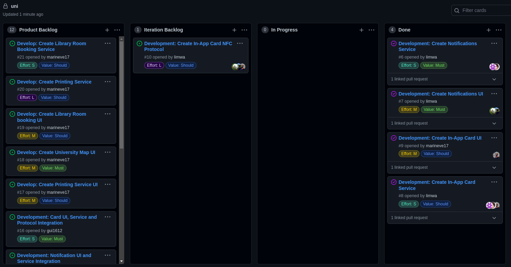
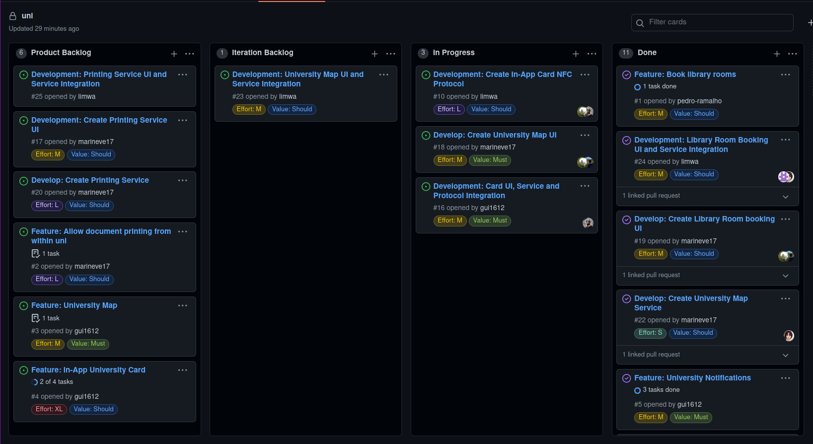
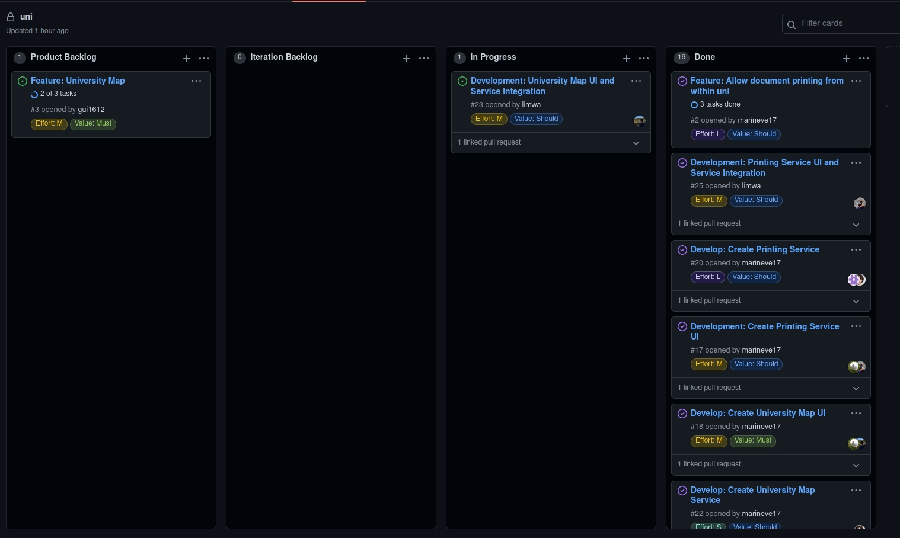

# Project Management

## Table of Contents

- [v1](#end-of-v1)
- [v2](#end-of-v2)
- [v3](#end-of-v3)

## End of v1

**Release:** https://github.com/LEIC-ES-2021-22/2LEIC09T3/releases/tag/v1

    

### Retrospective

#### What did we do well?

- We managed to implement most of what we had on the iteration backlog
- We improved on what we had designed previously for the UI mockups
- Good coordination between team members and a balanced workload

#### What would we do differently?

- Better time management by distributing the implementation of features across the entire iteration
- Implement integration tests

#
## End of v2

**Release:** https://github.com/LEIC-ES-2021-22/2LEIC09T3/releases/tag/v2

    

### Retrospective

#### What did we do well?

- We improved our time management
- We managed to finish most of the intended workload
- We implemented automated gherkin tests

#### What would we do differently?

- Better understanding of the effort and time needed to complete the expected assignments 

# 

## End of v3

**Release:** https://github.com/LEIC-ES-2021-22/2LEIC09T3/releases/tag/v3

    

### Retrospective

#### What did we do well?

- Good coordination between team members and a balanced workload
- We managed to implement all features planned for the project and iteration

#### What would we do differently?

- Better time management by distributing the implementation of features across the entire iteration
