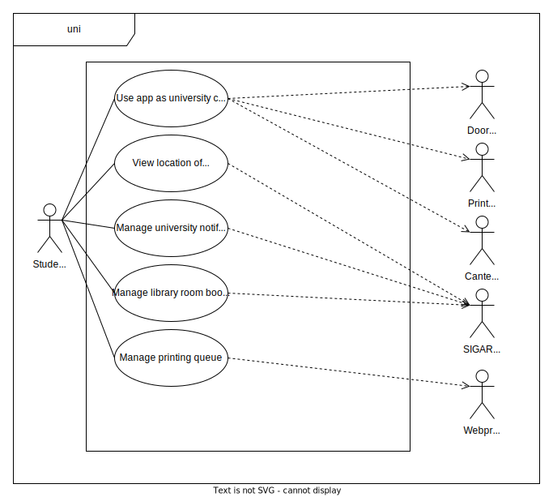

# Requirements

## Use case model

 

    

 

### In-app university card

|||
| --- | --- |
| *Name* | In-app university card |
| *Actor* | Student | 
| *Description* | Use the app to access NFC-enabled university services that require an university card, such as access to university facilities, printing, discounts on U.Porto canteens and library reservations. |
| *Preconditions* | - The user is logged in on the uni app.   - The service the user is trying to access is NFC-enabled. |
| *Postconditions* | - The student gains access to the given service. |
| *Normal flow* | 1. The student opens the university card page on the app.   2. The student touches the NFC-enabled reader with their phone.   3. Access to the NFC-enabled service is granted. |
| *Alternative flows and exceptions* | 1. [In-app card not enabled yet] If the user hasn't used the service before, they must click the button to create their app-specific card.   2. [Error in communication between phone and reader] If there is any error while the phone and the reader communicate with each other, an error message is shown to the user. |

 

### University map

|||
| --- | --- |
| *Name* | University map |
| *Actor* |  Student | 
| *Description* | Use the app to view the exact location of the classrooms they have lessons in. |
| *Preconditions* | - The user is logged in on the uni app.   - The student has at least one lesson on their timetable. |
| *Postconditions* | - The location of the classroom is displayed to the student. |
| *Normal flow* | 1. The student opens the timetable page on the app.   2. The student taps on the desired period and selects the option to view the location of that period's classroom.   3. A map with the location of the classroom is displayed.
| *Alternative flows and exceptions* ||

 

### University notifications

|||
| --- | --- |
| *Name* | University notifications |
| *Actor* | Student | 
| *Description* | Use the app to view and manage pending notifications from the university.|
| *Preconditions* | - The user is logged in on the uni app. |
| *Postconditions* | - The number of notifications is displayed to the user.   - If the user has pending notifications, they are displayed. |
| *Normal flow* | 1. The student opens the notifications page on the app.   2. The app displays all their pending notifications from the university.   3. The student marks a given notification as read.   4. The university is notified the user has read the notification. |
| *Alternative flows and exceptions* | 1. [Not marking a notification as read] The student may choose not to mark a notification as read. In this case, the notification remains on the notifications page. |

 

### Sticky notes

|||
| --- | --- |
| *Name* | Sticky notes |
| *Actor* |  Student | 
| *Description* | Use the app to add and manage sticky notes associated with a given Curricular Unit.|
| *Preconditions* | - The user is logged in on the uni app.   - The student is enrolled in at least one Curricular Unit.
| *Postconditions* | - The student is able to add sticky notes to a Curricular Unit.   - The student is able to manage existing sticky notes. |
| *Normal flow* | 1. The student opens the timetable page on the app.   2. The student taps on the desired Curricular Unit and selects the option to view that Curricular Unit's sticky notes.   3. All sticky notes of the selected Curricular Unit are displayed. |
| *Alternative flows and exceptions* | 1. [Managing sticky notes] The student may select an existing sticky note to remove or edit.   2. [View content of a given sticky note] The student can tap a given sticky note, in order to view its content in full detail.   3. [Adding a new sticky note] The student may tap on a button to add a new sticky note. Trying to go back while adding a new sticky note will prompt the user asking if they wish to keep or discard it. |

 

### Booking library rooms

|||
| --- | --- |
| *Name* | Library room bookings |
| *Actor* | Student | 
| *Description* | Use the app to book a library room on a given date and manage current bookings. |
| *Preconditions* | - The user is logged in on the app.   - There are rooms available for booking.   - The student is booking a room a day or more in advance. |
| *Postconditions* | - The user is notified of the result of the booking.   - The user can manage their current bookings. |
| *Normal flow* | 1. The student opens the bookings page on the app.   2. The user's current bookings are displayed. |
| *Alternative flows and exceptions* | 1. [Creating a new booking] The available rooms on the specified date are displayed and the user can choose which one they want to book. The user is notified of the booking result.   2. [Cancel current bookings] The user can cancel a given booking. |

 

### Printing

|||
| --- | --- |
| *Name* | Printing |
| *Actor* | Student | 
| *Description* | Use the app to view and manage personal print jobs. |
| *Preconditions* | - The user is logged in on the app. |
| *Postconditions* | - The student is able to view their printing queue.   - The user can manage their printing queue. |
| *Normal flow* | 1. The student opens the printing page  on the app.   2. A list of all pending printing jobs along with their printing balance is displayed to the user. |
| *Alternative flows and exceptions* | 1. [Scheduling new print jobs] If the user wants to print a document, a file picker is opened and the user can select the file they want to upload. After that, a menu asking for the print job options (B/W vs Color, A3 vs A4, ...) pops up. After the student submits the printing job, the document is pushed onto their printing queue.   2. [Removing documents] If the student wants to remove pending documents from their printing queue, the user can do so.   3. [Printing failure] If a failure occurrs (i.e. the user doesn't have enough money to schedule the printing job), the reason why the failure occurred is shown to the user and the student is taken back to the listing page. |

 

### Curricular Unit page

|||
| --- | --- |
| *Name* | Curricular Unit page |
| *Actor* | Student |
| *Description* | Use the app to see information about a given Curricular Unit and its professors. |
| *Preconditions* | - The user is logged in on the uni app.   - The student is enrolled in at least one Curricular Unit. |
| *Postconditions* | - The information about the Curricular Unit and its professors is displayed. |
| *Normal flow* | 1. The student opens the timetable page on the app.   2. The student taps on the desired Curricular Unit and selects the option to view that Curricular Unit's page.   3. The Curricular Unit page is displayed to the user.   4. If the user clicks a link on the page, they are redirected to the corresponding SIGARRA web page. |
| *Alternative flows and exceptions* | |
